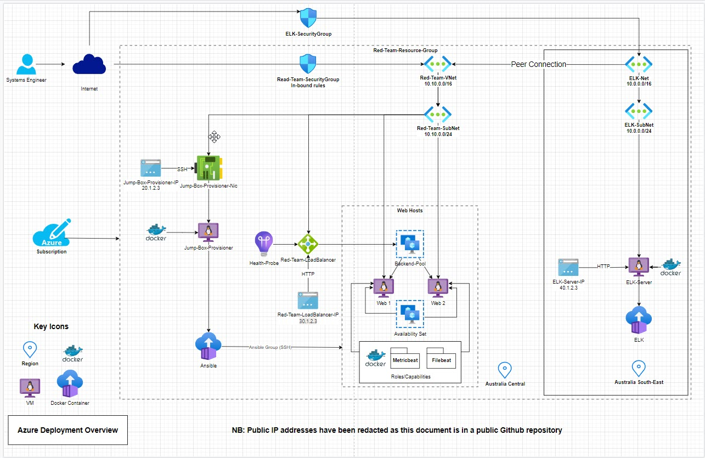

# Chris Nurse Homework - Week 13

This repository describes the process for the automated deployment of ELK, and related Beats, to web servers comprised by a broader Microsoft Azure hosted environment.

An Azure Subscription is created which comprises numerous cloud based services, including:

- A Network Security Group labelled for use by an imaginary Red Team
- A Network Security Group for an Elastic Stack and Kibana host (ELK)
- A Jump Box, which is used to provision Docker containers and other services hosted on Virtual Machines
- Load balanced Web Servers, which host a vulnerable application for test purposes

The purpose of this document is to describe the process for provisioning ELK. It is not the intention of this document to teach how to fully create the entire network diagram depicted.

**NOTE FOR GRADERS**

The broader network diagram is included herein, as it is valuable for the reader to see the full context in which virtual machines have been provisioned, which are then placed under the management of Ansible, comprised by the Jump Box.

Also, please note, that where IP addresses may have been required, dummy IP addresses have been placed in the diagram to protect the security of the network. Disclosing public IP addresses in a public Github repository would be bad practice.

# References and further reading

The following links are useful to gain a deeper understanding of ELK, Beats and various use cases for monitoring and alerting in the context of maintaining a secure highly-available service.

[ELK - Elastic Stack and Kibana](https://www.elastic.co/elastic-stack?ultron=B-Stack-Trials-APJ-ANZ-Exact&gambit=Stack-ELK&blade=adwords-s&hulk=paid&Device=c&thor=elk%20stack&gclid=Cj0KCQjw-daUBhCIARIsALbkjSbXNRF4Qn9NJWDiIwfhb5ifI32Da2DfduYRt3A3mWpL-2KfALd5F-0aAlxmEALw_wcB)

[YouTube - Getting Started With Kibana](https://www.youtube.com/watch?v=DVgKDPf7hOU)

[Filebeat](https://www.elastic.co/beats/filebeat)    

[Metricbeat](https://www.elastic.co/beats/metricbeat)


# Overview of the Azure Deployment

The following diagram provides a simple visual context for the entire Azure deployment, of which ELK is just a single capability.

The diagram utilises official Microsoft Azure icons in order to make it easier for organisations and security teams, who typically consume Azure services, to more quickly understand the services and resources used, together with interconnections, security configuration and the potential attack surface of the deployment.



## D*mn Vulnerable Web Application (DVWA)

DVWA is a web application provided as a learning resource, and is delivered as docker images, which are deployed as docker containers on two load balanced virtual machines (`Web Servers`).

To achieve a high-availability level of service, the two webservers are added into an `Availability Group`, and then to further strengthen the solution, the servers are fronted by a `Load Balancer` to ensure the workload is evenly split across the available resources. 

The `Load Balancer` restricts access to the network, as all traffic bound for the web servers must arrive at and pass through the load balancer, which has a public IP address.  Therefore the web servers themselves are only accessible to HTTP traffic, and not accessible via SSH or other remote access from outside the network. 

In summary, the `Load Balancer` increases availability and resilience of the web services.

The `Network Security Groups` contain in-bound rules that prevent unwanted traffic entering the network, and also restrict access to the `jumpbox` to a limited whitelisted IP address.

The advantage of having a `jumpbox` is that there only one configurable resource is exposed with a public IP address. The `jumpbox` is only accessible by users whose `SSH Key` has been added. This is considered best practice, and reduces the externally visible attack surface, as no other servers are accessible via SSH. The only other means of affecting the server configurations and services, would be to attack the Azure Subscriber's account, which would also have Multifactor Authentication mandated for login.


# Automated ELK Stack Deployment

Integrating an ELK server allows users to easily monitor the vulnerable VMs for changes to  system files, and verious events captured in the machine's logs. For example, web traffic filedownloads, geographic locations of users, and generally to be able to identify anomalies.

The configuration details of each machine may be found below.

| Name         | Function   | IP Address | Operating System |
|--------------|------------|------------|------------------|
| Jump Box     | Gateway    | 10.0.0.1   | Linux container  |
| Web server 1 | Web Server | LB IP      | Linux container  |                  
| Web server 2 | Web Server | LB IP      | Linux container  |                  
| ELK Server   | Monitoring | 10.0.0.4   | Linux container  |                  

**LB = Loadbalancer, which sits in front of the web servers**

### Access Policies

The machines on the internal network are not exposed to the public Internet. 

Only the jumpbox machine can accept connections from the Internet. Access to this machine is only allowed from the following IP addresses:
- _TODO: 50.1.2.3 **NOTE: Redacted for security reasons**

Machines within the network can only be accessed by the Jumpbox.

- _TODO: Which machine did you allow to access your ELK VM? What was its IP address?_

The ELK VM can only be accessed by the Ansible capability on the Jumpbox, as we have initially created an SSH from the Ansible container, and used the Azure configuration web pages to add this SSH key to each target VM.

A summary of the access policies in place can be found in the table below.

| Name     | Publicly Accessible | Allowed IP Addresses |
|----------|---------------------|----------------------|
| Jump Box | Yes                 | Student's Home IP - Redacted for security reasons |
|          |                     |                      |
|          |                     |                      |


## Establishing the ELK stack

In order to rapidly deploy ELK in a repeatable manner, Ansible has been used via the Jumpbox Provisioner, which targets the ELK group, to provision the ELK capability, then targets the Webserver group to establish the Beats capabilities.

### Deploying ELK as a docker container to the ELK Virtual Machine

The following playbook installs the ELK capability on to the ELK server, which was previously provisioned as virtual machine with Docker.

```
---
# /etc/ansible/install-elk.yml

- name: create ELK server
  hosts: elk
  become: true
  remote_user: azadmin
  tasks:
    - name: system setup
      sysctl:
        name: vm.max_map_count
        value: '262144'
        state: present
        reload: true

    - name: docker.io
      apt:
        update_cache: yes
        name: docker.io
        state: present

    - name: Install pip3
      apt:
        name: python3-pip
        state: present

    - name: Install Docker python module
      pip:
        name: docker
        state: present

    - name: download and launch a docker web container
      docker_container:
        name: elk
        image: sebp/elk:761
        state: started
        restart_policy: always
        published_ports:
          - 5601:5601
          - 9200:9200
          - 5044:5044

    - name: Enable docker service
      systemd:
        name: docker
        enabled: yes
```


## Deploying Beats capabilities

With ELK installed, we have established a Kibana front-end to be able to view and monitor traffic and key events.

Data is fed in to Kibana from servers on which we have installed Filebeats and Metricbeats, the playbooks for which are listed below:

### Filebeats

- _TODO: What does Filebeat watch for?_
In summary, Filebeat monitors the machine's logs, and "ships them", i.e. forwards the events from the logs to target ELK server. In this way it is possible to monitor key events like authentication and changes to key system files.

The Filebeat playbook for Ansible is as follows:

```
---
# /etc/ansible/filebeat-play.yml

- name: installing and launching filebeat
  hosts: webservers
  become: yes
  tasks:

  - name: download filebeat deb
    command: curl -L -O https://artifacts.elastic.co/downloads/beats/filebeat/filebeat-7.6.1-amd64.deb

  - name: install filebeat deb
    command: sudo dpkg -i filebeat-7.6.1-amd64.deb

  - name: drop in filebeat.yml
    copy:
      src: /etc/ansible/filebeat-config.yml
      dest: /etc/filebeat/filebeat.yml

  - name: enable and configure system module
    command: sudo filebeat modules enable system

  - name: setup filebeat
    command: sudo filebeat setup

  - name: start filebeat service
    command: sudo service filebeat start

  - name: enable service filebeat on boot
    systemd:
      name: filebeat
      enabled: yes

```

### Metricbeats

- _TODO: What does Metricbeat record?_

In summary, Metricbeat enables centralised monitoring of a machines key metrics, examples of which can be CPU utilisation, RAM utilisation and provide a means for key services to log additional metrics. For example, NGINX might provide metrics on traffic, and how it is routed amongst load balanced servers. 

The Metricbeat playbook for Ansible is as follows:

```
---
# /etc/ansible/metricbeats.yml

- name: installing and launching metricbeat
  hosts: webservers
  become: yes
  tasks:

  - name: download metricbeat deb
    command: curl -L -O https://artifacts.elastic.co/downloads/beats/metricbeat/metricbeat-7.6.1-amd64.deb

  - name: install metric beat
    command: sudo dpkg -i metricbeat-7.6.1-amd64.deb

  - name: drop in metricbeat.yml
    copy:
      src: /etc/ansible/metricbeat-config.yml
      dest: /etc/metricbeat/metricbeat.yml

  - name: enable and configure system module
    command: sudo metricbeat modules enable system docker

  - name: setup metricbeat
    command: sudo metricbeat setup

  - name: start metricbeat service
    command: sudo service metricbeat start

  - name: enable service metricbeat on boot
    systemd:
      name: metricbeat
      enabled: yes

```

This document contains the following details:
- Description of the Topology
- Access Policies
- ELK Configuration
  - Beats in Use
  - Machines Being Monitored
- How to Use the Ansible Build


### Elk Configuration

Ansible was used to automate configuration of the ELK machine. No configuration was performed manually, which is advantageous because...
- _TODO: What is the main advantage of automating configuration with Ansible?_

The playbook implements the following tasks:
- _TODO: In 3-5 bullets, explain the steps of the ELK installation play. E.g., install Docker; download image; etc._
- ...
- ...

The following screenshot displays the result of running `docker ps` after successfully configuring the ELK instance.


### Target Machines & Beats
This ELK server is configured to monitor the following machines:
- _TODO: List the IP addresses of the machines you are monitoring_

We have installed the following Beats on these machines:
- _TODO: Specify which Beats you successfully installed_

These Beats allow us to collect the following information from each machine:
- _TODO: In 1-2 sentences, explain what kind of data each beat collects, and provide 1 example of what you expect to see. E.g., `Winlogbeat` collects Windows logs, which we use to track user logon events, etc._

### Using the Playbook
In order to use the playbook, you will need to have an Ansible control node already configured. Assuming you have such a control node provisioned: 

SSH into the control node and follow the steps below:
- Copy the _____ file to _____.
- Update the _____ file to include...
- Run the playbook, and navigate to ____ to check that the installation worked as expected.

_TODO: Answer the following questions to fill in the blanks:_
- _Which file is the playbook? Where do you copy it?_
- _Which file do you update to make Ansible run the playbook on a specific machine? How do I specify which machine to install the ELK server on versus which to install Filebeat on?_
- _Which URL do you navigate to in order to check that the ELK server is running?

_As a **Bonus**, provide the specific commands the user will need to run to download the playbook, update the files, etc._